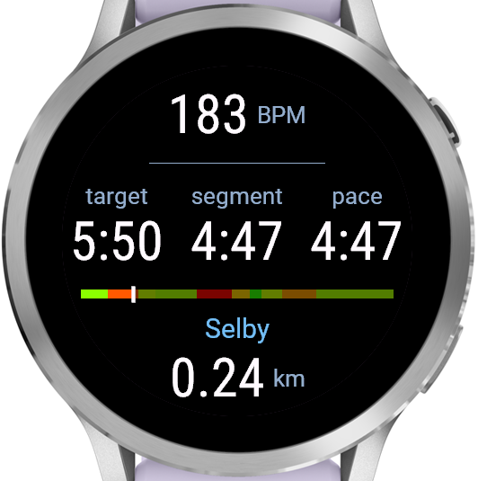
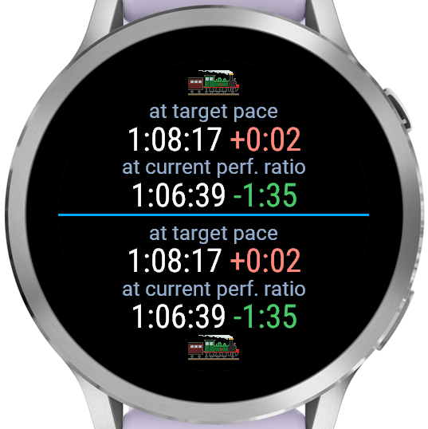
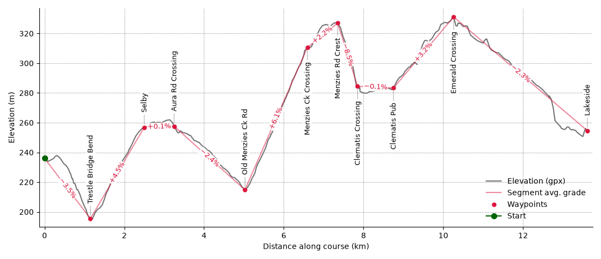
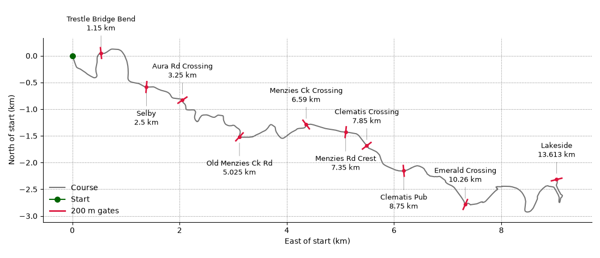

A data field for the Puffing Billy Great Train Race: a 13.6 km run on a fixed course,
split by named waypoints into segments, each with its own target pace worked out from
its grade (based on compile-time configuration).

Does not interact in any way with other activity configuration - segments and pace
targets as displayed by this data field are totally internally managed and have nothing
to do with activity laps or intervals or target paces.

The data field advances the display to the next segment based on the runner's GPS track
crossing a "gate" at each waypoint - a 200 m long line segment crossing the course,
defined by the GPS coordinates of its endpoints. In addition, if the GPS distance
accumulated in a segment is 200m longer than the expected length of the segment, the
next segment is triggered even if no gate is passed through. This allows for some
recovery if for some reason you run around a gate or have a very long GPS dropout.

Only tested on a Venu 4 41mm, and pace configuration is currently at compile-time, so
you're welcome to use this (or have your favourite chatbot adapt it to your use) but it
is substantially vibe-coded and not intended to be general.

the field
---------

What the field shows depends on how much of the display the activity's layout gives it.
You can have

### Given the whole face



Top to bottom:

- **Heart rate**, in bpm, with `---` until the watch has a reading.
- **target** - the current segment's target pace, in minutes per km.
- **segment** - average pace over the part of the current segment run so far
- **pace** - instantaneous pace, from the watch's current speed.
- **The bar** - the whole course, start at the left and finish at the right, one block
  per segment sized by its length and coloured by its target pace against the course
  average: green where the plan is fast, red where it's slow, amber in between. Course
  still to run is dimmed and course already run brighter, with a marker at the current
  position.
- **Next waypoint name** the waypoint being run towards, i.e. the end of the
  current segment.
- **Remaining segment distance** - how far is left to that waypoint, in km. It counts
  down, and can go negative if GPS distance (due to error or otherwise) in the segment
  grows larger than the expected segment length before reaching the next waypoint. If it
  reaches -200 m before the next waypoint is reached, the 

Once the last waypoint has been crossed the whole face reads `Finished`.

### Given half the face



Two projected finish times, each with how it stands against the planned finish - green
and negative for time in hand, red and positive for time lost.

- **at target pace** - the finish time if everything still to come is run at its target
  pace.
- **at current perf. ratio** - the finish time if the rest of the race is run at the
  same fraction of target pace as an average over the last 500 m

The screenshot is one activity layout with two data fields on it, both of them this one
- showing what it looks like in either the top or bottom half.


course data
-----------

The watch doesn't store the whole course, only pairs of GPS points straddling each
waypoint, which serve as "gates" - if you run across the line joining them, this
triggers the data field to move to the next segment.


The segments can be are configured in `segments/config.json`, the default contents of
which look like this:

```json
{
    "waypoints": {
        "Trestle Bridge": 1.150,
        "Selby": 2.500,
        "Aura Rd Crossing": 3.250,
        "Old Menzies Ck Rd": 5.025,
        "Menzies Ck Crossing": 6.590,
        "Menzies Rd Crest": 7.350,
        "Clematis Crossing": 7.850,
        "Clematis Pub": 8.750,
        "Emerald Crossing": 10.260,
        "Lakeside": 13.613
    },
    "pacing": {
        "flat_pace": "4:45",
        "uphill_penalty": 5,
        "downhill_bonus": 1.75
    }
}
```

Note: the "Trestle Bridge" waypoint occurs roughly when the bridge comes into view, not
at the bridge itself.

The official course `.gpx` for 2026 is in this repo as
`segments/official-course-2026.gpx`, and is used to extract segment grades. The default
segmentation results in these segments:






After editing `segments/config.json`, you can run `python segments/make_segments.py` to
extract grades for the segments, calculate paces based on the `flat_pace`,
`uphill_penalty` (percent pace increase per percent grade) and `downhill_bonus` (percent
pace reduction per percent grade) in `config.json`, and you can run `python
segments/plot_segments.py` to view the profile the segmentation implies.


`make_segments.py` produces `segments/out/resource.json` which gets included in the
compiled app and send to the watch.

Going through the pipeline (which `make` will run if needed in any case):

`segments/config.json` is the only file you edit to change the course or the
target pace. It holds:

- `waypoints`: the segment endpoints, as a name mapped to its distance in km
  into the course, in order. The last one is the finish.
- `pacing.flat_pace`: target pace on flat ground, `"m:ss"` per km.
- `pacing.uphill_penalty` and `pacing.downhill_bonus`: fractional slowdown and
  speedup per unit of grade, used to turn each segment's average grade into its
  target pace.

`make_segments.py` locates each waypoint along the `.gpx` track, fits the course
heading there, and builds the 200 m "gate" normal to that heading which the
runner passes through - see the waypoint crossing section below. It also
computes each segment's average grade from the track elevation and grade-adjusts
the flat pace to get a per-segment target pace. All of that lands in
`segments.json`, along with the working (heading, elevation, coordinates), and it
prints a per-segment pacing table plus the predicted total time.

`resource.json` is the part of that the data field actually needs - names,
lengths, paces and gates - as parallel arrays, with coordinates in integer
semicircles. It's trimmed and reshaped deliberately, to keep both heap and
floating point precision under control on the watch; `make_resource()`'s
docstring explains why.

`resources/jsonData/segments.xml` points the Connect IQ resource compiler at
`resource.json`, which is what makes it `$.Rez.JsonData.Segments` in the app.

`segments/out/` is gitignored, so it isn't in a fresh clone. Nothing needs doing
about that: `make build` depends on the `segments` target, which is phony and so
regenerates both files on every build - an edit to `config.json` can't be left
out of the `.prg`.

`segments/plot_segments.py` has no make target; run it by hand after
`make segments` to draw the course with the gates overlaid and the elevation
profile, into `segments/out/*.png`:

```bash
python segments/plot_segments.py
```

setup bits and bobs
-------------------

You'll need to install Garmin's Connect IQ SDK manager, make a developer account, and
use the SDK manager to install the SDK for your device.

Make developer key:

```bash
openssl genrsa -out developer_key.pem 4096
openssl pkcs8 -topk8 -inform PEM -outform DER -in developer_key.pem -out developer_key.der -nocrypt
```

Get exact device ID for device from device folder name:

```bash
$ ls ~/.Garmin/ConnectIQ/Devices/
venu441mm
```

Memory and resolution limits etc are in
`~/.Garmin/ConnectIQ/Devices/venu441mm/compiler.json`

patchelf to force simulator to use newer libs:
```bash
cd ~/.Garmin/ConnectIQ/Sdks/connectiq-sdk-lin-9.2.0-2026-06-09-92a1605b2/bin/
patchelf --replace-needed libwebkit2gtk-4.0.so.37 libwebkit2gtk-4.1.so.0 simulator
patchelf --replace-needed libjavascriptcoregtk-4.0.so.18 libjavascriptcoregtk-4.1.so.0 simulator
patchelf --replace-needed libsoup-2.4.so.1 libsoup-3.0.so.0 simulator
```

build commands
--------------

Build, writing `bin/PuffingBilly-venu441mm.prg`:

```bash
make
```

Regenerate the course data in `segments/out/` from `segments/config.json` and the
`.gpx` track. `make` does this for you before every build, so you only need it on
its own to see the pacing table it prints:

```bash
make segments
```

Run the simulator. Blocks, so give it its own terminal:

```bash
make sim
```

Build and load into the already-running simulator. Errors out if the simulator
isn't up:

```bash
make run
```

Sideload to the watch. Plug it in over USB and let gvfs mount it (MTP) first:

```bash
make deploy
```

Build a signed `.iq` bundle for the store, covering every product in the
manifest rather than just one:

```bash
make package
```

Delete `bin/`:

```bash
make clean
```

`DEVICE`, `KEY`, `TYPECHECK` (monkeyc `-l`, 0-3) and `SDK_ROOT` can be
overridden per invocation:

```bash
make run DEVICE=venu445mm
make build TYPECHECK=0
```

Waypoint crossing detection
---------------------------

Detecting when runner crosses a waypoint "gate" defined as a line segment AB (straddling
the course, 100m either side)

Runner's position from one update to the next is the line segment CD

To check these line segments intersect is four cross products:

```
Segments AB and CD. Compute four:

  d1 = cross(A, B, C)      // is C left or right of AB?
  d2 = cross(A, B, D)      // is D left or right of AB?
  d3 = cross(C, D, A)      // is A left or right of CD?
  d4 = cross(C, D, B)      // is B left or right of CD?

  They intersect (properly, i.e. crossing at interior points) iff each segment separates the other's endpoints:

  (d1 > 0) != (d2 > 0)  &&  (d3 > 0) != (d4 > 0)
```

Cross product cross(a, b, c) here means (b-a)×(c-a) which is `(bx - ax)*(cy - ay) - (by - ay)*(cx - ax)`
