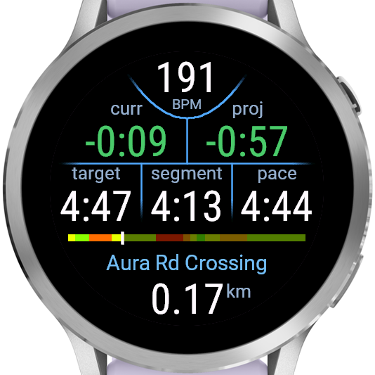
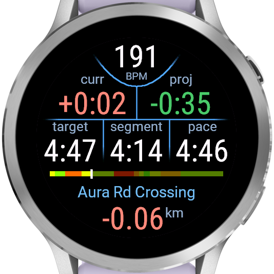
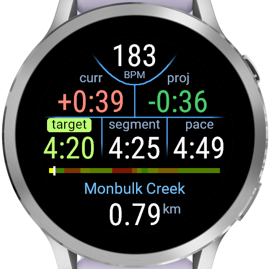
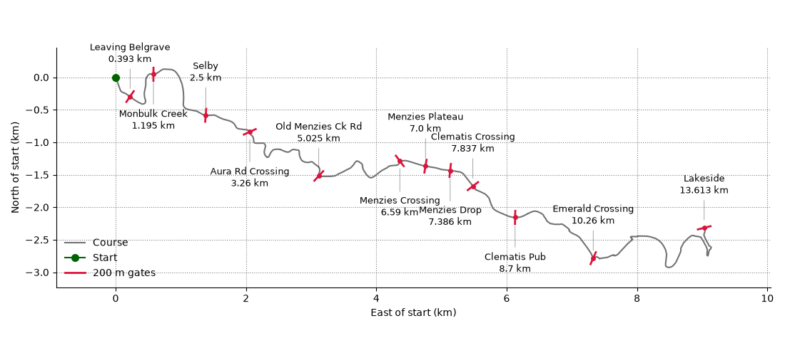
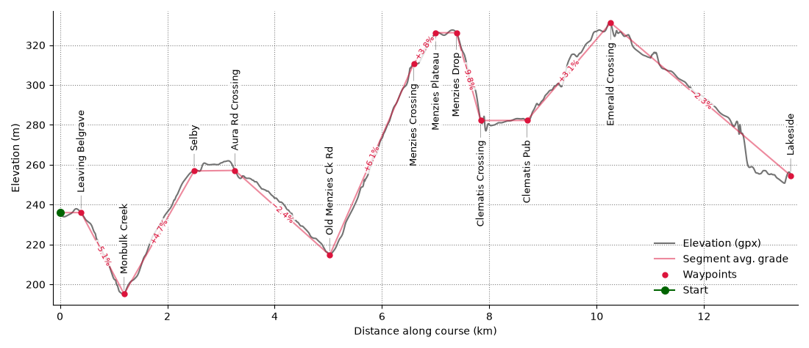

Garmin Puffing Billy race data field
------------------------------------

A data field for pacing in the Puffing Billy Running Festival 13.5 km classic,
with the course split into segments, each with its own target pace. This is useful
because PacePro does a poor job with segmenting hilly courses, particularly this one,
for which Garmin seems to have overly smoothed elevation data.

The watch doesn't store the course track - the segment displayed advances based on the
runner's GPS track crossing a "gate" (a 200 m long line segment crossing the course) at
each waypoint. As a fallback, if the GPS distance accumulated in a segment exceeds the
expected length of that segment by the configured `overdistance` (200 m by default), the
display also advances to the next segment even if no gate was passed. This allows for
some recovery if for some reason you run around a gate or have a very long GPS dropout.

The watch vibrates and plays a "next lap" tone upon advancing to the next segment.

Does not interact in any way with other activity configuration - segments and pace
targets as displayed by this data field are internally managed and have nothing to do
with activity laps or intervals or target paces.

Only tested on a Venu 4 41mm, and pace configuration is currently at compile-time, so
not especially user-friendly, but you're welcome to use or get your favourite chatbot to
adapt for your use. I expect it should work on most recent watches with at least a 390px
screen.

Data field contents
-------------------



The data field uses the full screen. From top to bottom and left to right:

- **Heart rate** - heart rate in bpm.
- **Current time ahead/behind** - time ahead (negative, green) or behind (positive, red)
  of the target finishing time, if the rest of the race is run at target pace.
- **Projected time ahead/behind** - the same, but if the rest of the race is instead run
  at the current performance ratio: the fraction of target pace at which you are
  currently running, measured as an exponential moving average over a distance scale
  `perf_ratio_scale`, 250 m by default, i.e. based on your performance over the last
  0.25–0.5 km or so (with time spent slower than 10 min/km not counted).
- **Target pace** - target pace for current segment in minutes per km. After advancing
  to a new segment, the new target pace is highlighted in the segment's colour from the
  progress bar.
- **Segment pace** - average pace over current segment so far in minutes per km.
- **Current pace** - current pace in minutes per km.
- **Progress bar** - distance progress bar of the course, with a marker at the current
  position and each segment coloured by its target pace: green when much faster than the
  target average pace, red when much slower, and orange in between.
- **Upcoming waypoint name** the name of the waypoint marking the end of the current
  segment.
- **Segment remaining distance** - distance to the next waypoint. Counts down, and can
  go negative if GPS distance (due to error or otherwise) in the segment grows larger
  than the expected segment length before reaching the next waypoint. If it goes
  negative by more than the configured `overdistance` (-200 m by default), the display
  advances to the next segment despite not having encountered the expected waypoint.

Before the activity has been started, the waypoint name, progress bar, remaining
distance, and target pace will cycle through the different segments showing the entire
planned course. This can be used to verify that paces and distances were configured
correctly ahead of time.

### More screenshots

When the GPS distance accumulated in a segment exceeds the expected segment length (due
to GPS error or otherwise), the remaining distance to the next waypoint shows as a
negative value in red:



When moving to a new segment, the target pace is highlighted in a colour corresponding
to its pace (green = much faster than course average, red = much slower, yellow = in
between):



Waypoint description
--------------------





The default waypoints are:

| distance into course   | name    | description                                                                       |
| :--------- | :------------------ | :-------------------------------------------------------------------------------- |
|  0.393 km  | Leaving Belgrave    | End of the flat opening segment of the course                                     |
|  1.195 km  | Monbulk Creek       | Where the course crosses Monbulk Creek, before the Trestle Bridge comes into view |
|  2.500 km  | Selby               | Selby township                                                                    |
|  3.260 km  | Aura Rd Crossing    | Where the railway crosses the course on Selby-Aura Rd                             |
|  5.025 km  | Old Menzies Ck Rd   | Corner at Old Menzies Ck Rd where the course turns to stay on Selby-Aura Rd       |
|  6.590 km  | Menzies Crossing    | Where the railway crosses the course in Menzies Creek township                    |
|  7.000 km  | Menzies Plateau     | End of climb and start of flat segment on Menzies Rd                              |
|  7.386 km  | Menzies Drop        | End of flat segment and start of steep drop on Menzies Rd                         |
|  7.837 km  | Clematis Crossing   | Just after the railway and course both cross Belgrave-Gembrook Rd in Clematis     |
|  8.700 km  | Clematis Pub        | About 100 metres after the course passes Clematis Pub                             |
| 10.260 km  | Emerald Crossing    | Where the railway crosses the course after Emerald Railway Station                |
| 13.613 km  | Lakeside            | Finish line at Emerald Lake                                                       |

Configuration
-------------

Desired segments and target pacing is configured in `config.toml`, see there for
details. It has three sections:

- `[waypoints]` - name and distance into the course of the waypoints marking the
  boundaries between segments

- `[pacing]` - either an explicit list `paces` giving target paces for each segment, or
  equivalent flat pacing information `flat_pace` and `split_delta` from which
  per-segment paces are calculated, grade-adjusted using [Strava's grade-adjusted pace
  (GAP) curve](https://aaron-schroeder.github.io/reverse-engineering/grade-adjusted-pace.html)

- `[tracking]` - other configuration parameters used on the watch: `overdistance` and
  `perf_ratio_scale`

Note that this doesn't involve specifying your actual target race time, which is instead
calculated from the per-segment paces. You can run `make_segments.py` to see the
per-segment paces and implied total time.

The official course `.gpx` for 2026 is in this repo as `official-course-2026.gpx`, and
is used to extract segment grades. The default segmentation results in the grades shown
in the course elevation plot above.

If you change the waypoints, you will want to verify that the waypoint gates (red line
segments in the image above) don't intersect the course at any point earlier than the
waypoint itself, otherwise this will trigger premature detection of reaching the
waypoint. You can do this by running `plot_segments.py` after `make segments` has run,
which shows the plots interactively so you can zoom in to check.

Going through the pipeline, which `make` runs for you whenever it is out of date:

`make_segments.py` locates each waypoint along the `.gpx` track, fits the course heading
there, and builds the 200 m "gate" normal to that heading which the runner passes
through. It also computes each segment's average grade from the track elevation, and,
unless the paces are given per segment, grade-adjusts the flat pace at that point in the
course to get the segment's target pace. These results are saved in detail to
`out/segments.json` for use by `plot_segments.py`, and in more minimal form to
`out/resource.json` as needed by the watch. A per-segment pacing table and the predicted
total time are also printed.

`out/resource.json` is the data actually included on the watch: segment names, lengths,
and target paces, the gate coordinates, and the overdistance and performance ratio
averaging scale config parameters.

`plot_segments.py` plots the course with the gates overlaid and the elevation profile
(saved to `out/course_gates.png` and `out/course_elevation.png`) to check that they are
sane. Run it directly (after `make segments`) for interactive plots you can zoom in on;
`make plots` runs it headlessly and refreshes the copies of the plots embedded in this
README.

Setup 
-----

Not comprehensive setup instructions, just some scattered notes:

You'll need to install Garmin's Connect IQ SDK manager, make a developer account, and
use the SDK manager to install the SDK for your device.

The course pipeline needs Python with `numpy` (and matplotlib if running
`plot_segments.py`)

You need to make a developer key:

```bash
mkdir .secrets
openssl genrsa -out .secrets/developer_key.pem 4096
openssl pkcs8 -topk8 -inform PEM -outform DER -in .secrets/developer_key.pem -out .secrets/developer_key.der -nocrypt
```

To add support for a device, get exact device ID for device from device folder name and
add this to `manifest.xml`

```bash
$ ls ~/.Garmin/ConnectIQ/Devices/
venu441mm
```

Memory and resolution limits etc are in e.g.
`~/.Garmin/ConnectIQ/Devices/venu441mm/compiler.json`

Use `patchelf` to force simulator to use newer libs (may need to do this for the SDK
manager GUI as well):

```bash
cd ~/.Garmin/ConnectIQ/Sdks/connectiq-sdk-lin-9.2.0-2026-06-09-92a1605b2/bin/
patchelf --replace-needed libwebkit2gtk-4.0.so.37 libwebkit2gtk-4.1.so.0 simulator
patchelf --replace-needed libjavascriptcoregtk-4.0.so.18 libjavascriptcoregtk-4.1.so.0 simulator
patchelf --replace-needed libsoup-2.4.so.1 libsoup-3.0.so.0 simulator
```

Build commands
--------------

Build, writing `bin/PuffingBilly-venu441mm.prg`:

```bash
make
```

Regenerate the course data in `out/` from `config.toml` and the `.gpx` track. A build
does this for you when it needs to, so you only need it on its own for the pacing table
it prints, or before running `plot_segments.py`:
```bash
make segments
```

Regenerate the course plots in `out/` and refresh the copies of them embedded in this
README:
```bash
make plots
```

Run the simulator. Blocks, so give it its own terminal:
```bash
make sim
```

Build and load into the already-running simulator.
```bash
make run
```

Sideload to the watch. Plug it in over USB and let gvfs mount it (MTP) first:
```bash
make deploy
```

Build a signed `.iq` bundle for the store, covering every product in the
manifest rather than just one:
```bash
make package
```

Delete `bin/` and the generated course data in `out/`:
```bash
make clean
```

`DEVICE`, `KEY`, `TYPECHECK` (monkeyc `-l`, 0-3), `PYTHON` and `SDK_ROOT` can be
overridden per invocation:
```bash
make run DEVICE=venu445mm
make build TYPECHECK=0
```

Source
------

Brief summary of what each file in `source/` is for:

- `PuffingBillyApp.mc` - minimal boilerplate app shell.
- `PuffingBillyField.mc` - main data field class, including its callbacks and drawing.
- `Course.mc` - segments, target paces, waypoint gate coordinates, read from the
  compiled-in JSON resource, plus the line-crossing test against a gate.
- `Race.mc` - the race in progress: which segment is being run, how far and how long
  into it, performance ratio, projected finishing time.
- `Layout.mc` - vertical layout calculations.
- `Face.mc` - watch-face geometry and details of the screen region the field has been
  assigned.
- `Roboto.mc` - glyph metrics for the font we use.
- `Fmt.mc` - string formatting of paces and time ahead/behind.

