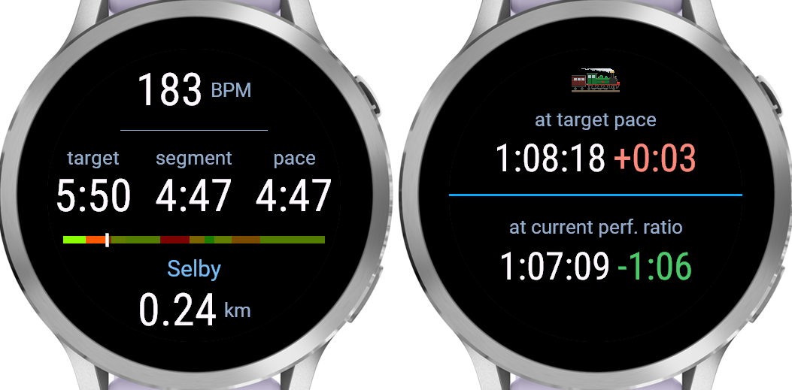

A data field for the Puffing Billy Great Train Race: a 13.6 km run on a fixed course,
split by named waypoints into segments, each with its own target pace worked out from
its grade (based on compile-time configuration).

Does not interact in any way with other activity configuration - segments and pace
targets as displayed by this data field are totally internally managed and have nothing
to do with activity laps or intervals or target paces. Activity pausing is ignored (you
can't pause a race!).

The data field advances the display to the next segment based on the runner's GPS track
crossing a "gate" at each waypoint - a 200 m long line segment crossing the course,
defined by the GPS coordinates of its endpoints. In addition, if the GPS distance
accumulated in a segment runs past the expected length of the segment by the configured
`overdistance` (200 m by default), the next segment is triggered even if no gate is
passed through. This allows for some recovery if for some reason you run around a gate
or have a very long GPS dropout.

Only tested on a Venu 4 41mm, and pace configuration is currently at compile-time, so
you're welcome to use this (or have your favourite chatbot adapt it to your use) but it
is substantially vibe-coded and not intended to be general.

the field
---------



What the field shows depends on how much of the display the activity's layout gives it.

It has a full-screen version, and two half-screen versions (top and bottom half). You
can include the full-screen version on one data screen and both half-screen versions on
another, to see everything.

### Given the whole face

Top to bottom:

- **Heart rate**, in bpm, with `---` until the watch has a reading.
- **target** - the current segment's target pace, in minutes per km.
- **segment** - average pace over the part of the current segment run so far
- **pace** - instantaneous pace, from the watch's current speed.
- **The bar** - the whole course, start at the left and finish at the right, one block
  per segment sized by its length and coloured by its target pace against the course
  average: green where the plan is fast, red where it's slow, amber in between. Course
  still to run is dimmed and course already run brighter, with a marker at the current
  position.
- **Next waypoint name** the waypoint being run towards, i.e. the end of the
  current segment.
- **Remaining segment distance** - how far is left to that waypoint, in km. It counts
  down, and can go negative if GPS distance (due to error or otherwise) in the segment
  grows larger than the expected segment length before reaching the next waypoint. If it
  goes negative by more than the configured `overdistance` (-200 m by default), the
  field advances to the next segment despite not having encountered the expected
  waypoint.

Before the activity has been started, the waypoint name, progress bar, remaining
distance, and target pace will cycle through the different segments showing the entire
planned course. This can be used to verify paces and distances were configured correctly
before actually starting the race.

### Given half the face

One projected finish time, with how it stands against the planned finish - green and
negative for time in hand, red and positive for time lost. Which projection you get
depends on which half of the display the field has been given:

- **at target pace** (top half): finishing time if the rest of the race is run at
  target paces
- **at current perf. ratio** (bottom half): finishing time if the rest of the race is
  run at the same fraction of target pace as you are currently running (measured as an
  exponential moving average with a scale of the configured `perf_ratio_scale`, 500 m by
  default, so based on your performance over the last 0.5–1 km or so)

Put the field on both halves of a data screen to see both projected finishing times, as
in the screenshot.


Segment and pacing configuration
--------------------------------

Desired segments and and target pacing is configured in `config.toml`, see there for
details. It has three sections:

- `[waypoints]` - name and distance into the course of the waypoints marking the
  boundaries between segments

- `[pacing]` - either an explicit list `paces` giving target paces for each segment, or
  equivalent flat pacing information `flat_pace`, `split_delta`, and grade penalty/bonus
  `uphill_penalty` and `downhill_bonus` from which per-segment grade-adjusted paces are
  calculated

- `[tracking]` - other configuration parameters used on the watch: `overdistance` and
  `perf_ratio_scale`

Note that this doesn't involve specifying your actual target race time, which is instead
calculated from the per-segment paces. You can run `make_segments.py` to see the
per-segment paces and implied total time.

The official course `.gpx` for 2026 is in this repo as `official-course-2026.gpx`, and
is used to extract segment grades. The default segmentation results in the below
segments:


If you change the waypoints, you will want to verify that the waypoint gates (red line
segments in the image above) don't intersect the course at any point earlier than the
waypoint itself, otherwise this will trigger premature detection of reaching the
waypoint. You can do this by running `plot_segments.py` after `make_segments.py` has
run.

Going through the pipeline, which `make` runs for you whenever it is out of date:

`make_segments.py` locates each waypoint along the `.gpx` track, fits the course heading
there, and builds the 200 m "gate" normal to that heading which the runner passes
through - see the waypoint crossing section below. It also computes each segment's
average grade from the track elevation, and, unless the paces are given per segment,
grade-adjusts the flat pace the split delta calls for at that point in the course to get
the segment's target pace. These results are saved in detail to `out/segments.json`for
use by `plot_segments.py`, and in the more minimal form needed by the watch as
`out/resource.json`, and it prints a per-segment pacing table plus the predicted total
time.

`out/resource.json` is the data actually included on the watch: segment names, lengths,
and target paces, the gate coordinates, and the overdistance and performance ratio
averaging scale config parameters.

`plot_segments.py` is not part of the `make` pipeline, but can be run manually after
`make segments` to plot the course with the gates overlaid and the elevation profile
(saved to `out/course_gates.png` and `out/course_elevation.png`) to check they are sane.

source
------

One class or module per job, under `source/`:

- `PuffingBillyApp.mc` - the app shell, which returns the field as its only view.
- `PuffingBillyField.mc` - the data field itself: the three callbacks, the colours and
  all of the drawing.
- `Course.mc` - the segments, their target paces and their gates, read from the
  compiled-in JSON resource, plus the line-crossing test against a gate.
- `Race.mc` - the race in progress: which segment is being run, how far and how long
  into it, how hard it is being run against the plan, and the two projected finishes.
- `Layout.mc` - the vertical rhythm, solved whenever the screen region the field has
  been given changes, and read on every draw.
- `Face.mc` - the round display, where the field has been placed on it, and the circle
  left once the bezel clearance is taken off.
- `Roboto.mc` - the glyph metrics the Graphics API doesn't report.
- `Fmt.mc` - string formatting of paces, durations and standings as strings.

setup bits and bobs
-------------------

You'll need to install Garmin's Connect IQ SDK manager, make a developer account, and
use the SDK manager to install the SDK for your device.

The course pipeline needs Python with `numpy` (and matplotlib if running
`plot_segments.py`)

Make developer key:

```bash
mkdir .secrets
openssl genrsa -out .secrets/developer_key.pem 4096
openssl pkcs8 -topk8 -inform PEM -outform DER -in .secrets/developer_key.pem -out .secrets/developer_key.der -nocrypt
```

Get exact device ID for device from device folder name:

```bash
$ ls ~/.Garmin/ConnectIQ/Devices/
venu441mm
```

Memory and resolution limits etc are in
`~/.Garmin/ConnectIQ/Devices/venu441mm/compiler.json`

patchelf to force simulator to use newer libs (may need to do this for the SDK manager as well):
```bash
cd ~/.Garmin/ConnectIQ/Sdks/connectiq-sdk-lin-9.2.0-2026-06-09-92a1605b2/bin/
patchelf --replace-needed libwebkit2gtk-4.0.so.37 libwebkit2gtk-4.1.so.0 simulator
patchelf --replace-needed libjavascriptcoregtk-4.0.so.18 libjavascriptcoregtk-4.1.so.0 simulator
patchelf --replace-needed libsoup-2.4.so.1 libsoup-3.0.so.0 simulator
```

build commands
--------------

Build, writing `bin/PuffingBilly-venu441mm.prg`:

```bash
make
```

Regenerate the course data in `out/` from `config.toml` and the `.gpx` track,
without building. A build does this for you when it needs to, so you only need
it on its own for the pacing table it prints, or before `plot_segments.py`:

```bash
make segments
```

Run the simulator. Blocks, so give it its own terminal:

```bash
make sim
```

Build and load into the already-running simulator. Errors out if the simulator
isn't up:

```bash
make run
```

Sideload to the watch. Plug it in over USB and let gvfs mount it (MTP) first:

```bash
make deploy
```

Build a signed `.iq` bundle for the store, covering every product in the
manifest rather than just one:

```bash
make package
```

Delete `bin/`:

```bash
make clean
```

`DEVICE`, `KEY`, `TYPECHECK` (monkeyc `-l`, 0-3) and `SDK_ROOT` can be
overridden per invocation:

```bash
make run DEVICE=venu445mm
make build TYPECHECK=0
```
